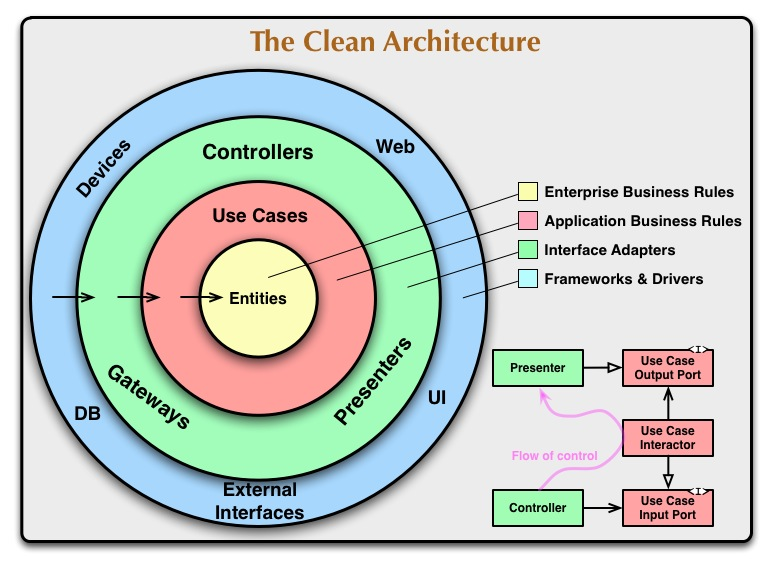

# Template de Clean Architecture e Domain-Driven Design (DDD) com NestJS

## Índice

1. [Introdução](#introdução)
2. [Tecnologias e Conceitos Utilizados](#tecnologias-e-conceitos-utilizados)
3. [Arquitetura do Projeto](#arquitetura-do-projeto)
    - [Visão Geral](#visão-geral)
    - [Camadas da Arquitetura](#camadas-da-arquitetura)
    - [Fluxo de Dados](#fluxo-de-dados)
    - [Organização de Pastas](#organização-de-pastas)
4. [Domain-Driven Design (DDD)](#domain-driven-design-ddd)
    - [Modelagem Estratégica](#modelagem-estratégica)
    - [Modelagem Tática](#modelagem-tática)
        - [Entidades](#entidades)
        - [Objetos de Valor](#objetos-de-valor)
        - [Agregados](#agregados)
        - [Repositórios](#repositórios)
5. [Exemplo de Implementação de um Aggregate Root](#exemplo-de-implementação-de-um-aggregate-root)
    - [Visão Geral](#visão-geral-1)
    - [Implementação Detalhada](#implementação-detalhada)
        - [Importações e Dependências](#importações-e-dependências)
        - [Identificador do Aggregate Root](#identificador-do-aggregate-root)
        - [Classe `ExampleAggregateRoot`](#classe-exampleaggregateroot)
            - [Método `create`](#método-create)
            - [Método `validate`](#método-validate)
            - [Métodos Getters](#métodos-getters)
            - [Métodos de Modificação](#métodos-de-modificação)
        - [Implementação do Validador](#implementação-do-validador)
            - [Classe `ExampleRules`](#classe-examplerules)
            - [Classe `ExampleValidator`](#classe-examplevalidator)
            - [Classe `ExampleValidatorFactory`](#classe-examplevalidatorfactory)
    - [Considerações Finais](#considerações-finais)
    - [Benefícios da Abordagem](#benefícios-da-abordagem)
    - [Recomendações para Novos Desenvolvedores](#recomendações-para-novos-desenvolvedores)
6. [Configuração e Instalação](#configuração-e-instalação)
7. [Testes](#testes)
8. [Anexos](#anexos)
    - [Links e Referências Úteis](#links-e-referências-úteis)

---

## Introdução

Este template **Clean Architecture e Domain-Driven Design (DDD) com NestJS** é uma base para a construção de aplicações backend eficientes e escaláveis. Ele inclui funcionalidades fundamentais, padrões de projeto e uma estrutura arquitetural que facilita a manutenção, evolução e colaboração em equipe, alinhando-se com as melhores práticas de desenvolvimento de software.

## Tecnologias e Conceitos Utilizados

- **NestJS**: Framework Node.js para a construção de aplicações server-side eficientes e escaláveis.
- **Clean Architecture**: Padrão arquitetural que promove a separação de preocupações e facilita a manutenção e evolução do software.
- **Domain-Driven Design (DDD)**: Abordagem de desenvolvimento focada no domínio do negócio e sua lógica.

## Arquitetura do Projeto

### Visão Geral

A arquitetura do projeto segue os princípios da Clean Architecture, onde a dependência flui de fora para dentro, e as camadas internas não conhecem as externas. Isso permite que o domínio permaneça independente de frameworks e tecnologias externas.



### Camadas da Arquitetura

1. **Camada de Apresentação (Interface de Usuário)**
    - Responsável por lidar com as interfaces de entrada e saída.
    - Implementada utilizando os controladores do NestJS e presenters.

2. **Camada de Aplicação**
    - Contém os casos de uso do aplicativo.
    - Orquestra a interação entre as camadas de apresentação e de domínio.

3. **Camada de Domínio**
    - Centro da aplicação, contém a lógica de negócio.
    - Implementa o DDD na definição de entidades, objetos de valor e agregados.

4. **Camada de Infraestrutura**
    - Fornece implementações concretas para interfaces definidas nas camadas superiores.
    - Lida com detalhes como persistência de dados, serviços externos, etc.

### Fluxo de Dados

1. **Requisição chega ao Controlador** na camada de apresentação.
2. **Controlador chama o Caso de Uso** apropriado na camada de aplicação.
3. **Caso de Uso interage com o Domínio**, manipulando entidades e aplicando regras de negócio.
4. **Repositórios são usados** para persistir ou recuperar dados.
5. **Resposta é enviada de volta** através do controlador.

### Organização de Pastas

A estrutura de pastas do projeto segue o seguinte padrão:

```
src/    # Pasta raiz do projeto
|-- main.ts          # Arquivo de inicialização da aplicação
|-- app.module.ts    # Módulo principal da aplicação
|-- core/            # Representa a divisão das camadas da arquitetura por módulos, representando agregados
|   |-- @shared/            # Módulo que contém recursos compartilhados entre diferentes módulos
|      |-- application/           # Recursos genéricos da camada de aplicação usados em diferentes módulos
|      |-- domain/                # Definições de entidades, objetos de valor, agregados, etc.
|      |-- infrastructure/        # Definições de interfaces e abstrações para repositórios, serviços externos, etc.
|   |-- example/            # Exemplo de core module, com as camadas de aplicação, domínio e infraestrutura
|-- nest-modules/    # Módulos do NestJS
|   |-- config-module/      # Módulo de configuração da aplicação
|   |-- database-module/    # Módulo de conexão com o banco de dados
|   |-- shared-module/      # Módulo compartilhado com recursos genéricos
|   |-- example-module/     # Módulo de exemplo, contendo integração de recursos do Nest com recursos do core (repositórios e use cases)

test/    # Pasta com testes de integração
envs/    # Pasta com arquivos de configuração de ambiente
```

## Domain-Driven Design (DDD)

### Modelagem Estratégica

Domain-Driven Design não se refere apenas à implementação de padrões como Repository ou Service. É uma abordagem de desenvolvimento que visa alinhar o código com o domínio do negócio, tornando-o mais legível e fácil de manter.

Ao criar uma feature, concentre-se em como o domínio do negócio se comporta e como representá-lo no código. Utilize conceitos de DDD como **Bounded Contexts** e **Linguagem Ubíqua** para orientar seu desenvolvimento.

Para este template, pode-se implementar a metodologia **Event Storming**, que mapeia os principais eventos do sistema e suas interações. Adaptar conforme as necessidades do projeto específico.

### Modelagem Tática

Em DDD, utilizamos uma série de padrões para implementar conceitos de domínio no código:

#### Entidades

- Representam objetos com identidade única no domínio.
- Exemplo: `Usuario`, `Produto`, `Pedido`.

#### Objetos de Valor

- Objetos imutáveis definidos por seus atributos.
- Exemplo: `Data`, `E-mail`.

#### Agregados

- Conjunto de entidades e objetos de valor tratados como uma unidade.
- Possuem uma raiz que controla a consistência.

#### Repositórios

- Interfaces que abstraem a persistência de agregados.
- Definidas na camada de domínio e implementadas na camada de infraestrutura.

## Exemplo de Implementação de um Aggregate Root

### Visão Geral

Esta seção tem como objetivo auxiliar novos desenvolvedores a compreender a implementação de um **Aggregate Root** no contexto do Domain-Driven Design (DDD) utilizando TypeScript e padrões de projeto. A classe `ExampleAggregateRoot` servirá como base para a construção de outros agregados no template.

No DDD, um **Aggregate Root** é a entidade principal que agrupa um conjunto de objetos relacionados, garantindo a consistência e integridade dos dados dentro do domínio. A implementação a seguir utiliza:

- **Objetos de Valor (Value Objects)**: Objetos imutáveis que representam valores do domínio.
- **Entidades (Entities)**: Objetos com identidade única e ciclo de vida próprio.
- **Validadores (Validators)**: Classes responsáveis por validar as regras de negócio das entidades.
- **Métodos de Fábrica (Factory Methods)**: Métodos estáticos que encapsulam a lógica de criação de objetos.

---

### Implementação Detalhada

#### Importações e Dependências

```typescript
import { Uuid } from "../../@shared/domain/value-objects/uuid.vo";
import { AggregateRoot } from "../../@shared/domain/aggregate-root";
import { ExampleValidatorFactory } from "@core/example/domain/example.validator";
```

- **Uuid**: Um Objeto de Valor que representa um identificador único universal (UUID).
- **AggregateRoot**: Classe base que fornece funcionalidades comuns para agregados.
- **ExampleValidatorFactory**: Fábrica que cria instâncias do validador para a entidade.

#### Identificador do Aggregate Root

```typescript
export class ExampleAggregateRootId extends Uuid {}
```

- **ExampleAggregateRootId**: Classe que estende `Uuid` para tipar o identificador do agregado.
- **Motivação**: Tipar o ID do agregado aumenta a segurança e clareza do código, evitando erros de atribuição de IDs incorretos.

#### Classe `ExampleAggregateRoot`

```typescript
export class ExampleAggregateRoot extends AggregateRoot<ExampleAggregateRootId> {
  constructor(
    id: ExampleAggregateRootId,
    private name: string,
    private age: number,
  ) {
    super(id);
    this.name = name;
  }

  // ...
}
```

- **Extensão de AggregateRoot**: A classe estende `AggregateRoot` tipando o ID com `ExampleAggregateRootId`.
- **Propriedades Privadas**: `name` e `age` são propriedades privadas da entidade.
- **Construtor**: Inicializa o agregado com um ID, nome e idade. Perceba que ele não possui a chamada para o método `validate`, pois ele serve ao propósito de transformar dados já existentes num objeto de domínio.

##### Método `create`

```typescript
public static create(name: string, age: number): ExampleAggregateRoot {
  const id = ExampleAggregateRootId.random();
  const aggregate = new ExampleAggregateRoot(id, name, age);
  aggregate.validate();
  return aggregate;
}
```

- **Padrão Factory Method**: Método estático que cria e valida uma nova instância do agregado.
- **Geração de ID**: Utiliza `ExampleAggregateRootId.random()` para criar um ID único.
- **Validação**: Chama `aggregate.validate()` para assegurar que a entidade está consistente antes de ser utilizada.
- **Motivação**: Centralizar a lógica de criação e garantir que todas as instâncias sejam validadas imediatamente após a criação.

##### Método `validate`

```typescript
validate(fields?: string[]): void {
  const validator = ExampleValidatorFactory.create();
  validator.validate(this.notification, this, fields);
}
```

- **Validação de Regras de Negócio**: Utiliza um validador para verificar se a entidade atende às regras definidas.
- **Não lançamento de exceções na camada de domínio**: erros de validação são registrados numa instância de `INotification` para que sejam tratados em camadas superiores. Nesse caso, a camada de aplicação é responsável por lidar com esses erros.
- **Parâmetro `fields`**: Permite validar campos específicos, útil em atualizações parciais.
- **Motivação**: Manter a entidade sempre num estado válido, seguindo o princípio da consistência no DDD.

##### Métodos Getters

```typescript
public getName(): string {
  return this.name;
}

public getAge(): number {
  return this.age;
}
```

- **Encapsulamento**: Fornecem acesso controlado às propriedades privadas.
- **Motivação**: Proteger a integridade dos dados e fornecer uma interface clara para interação com a entidade.

##### Métodos de Modificação

```typescript
public changeName(name: string): void {
  this.name = name;
}

public changeAge(age: number): void {
  this.age = age;
  this.validate(["age"]);
}
```

- **`changeName`**: Atualiza o nome sem validação adicional.
- **`changeAge`**: Atualiza a idade e valida o campo `age`.
- **Motivação**:
    - **changeName**: Assumimos que qualquer nome é válido neste contexto.
    - **changeAge**: Idade possui regras de negócio (e.g., ser maior de idade), portanto, a validação é necessária após a alteração.

---

#### Implementação do Validador

##### Importações e Dependências

```typescript
import { ExampleAggregateRoot } from "@core/example/domain/example.aggregate";
import { ClassValidatorFields } from "@core/@shared/domain/validators/class-validator-fields";
import { INotification } from "@core/@shared/domain/validators/notification.interface";
import { IsPositive, Min } from "class-validator";
```

- **ClassValidatorFields**: Classe base que integra o `class-validator` para validações.
- **INotification**: Interface para notificação de erros.
- **Decoradores do `class-validator`**: `IsPositive` e `Min` são usados para definir regras de validação.

##### Classe `ExampleRules`

```typescript
class ExampleRules {
  @Min(18, { message: "Deve ser maior de idade", groups: ["age"] })
  @IsPositive({ message: "Idade deve ser um número positivo", groups: ["age"] })
  age: number;

  constructor(aggregate: ExampleAggregateRoot) {
    Object.assign(this, aggregate);
  }
}
```

- **Definição de Regras**: Utiliza decoradores para especificar as regras de validação do campo `age`.
    - **`@Min(18)`**: Idade mínima de 18 anos.
    - **`@IsPositive()`**: Idade deve ser um número positivo.
- **Grupos de Validação**: O parâmetro `groups: ["age"]` permite validar campos específicos.
- **Construtor**: Atribui as propriedades do agregado às regras, permitindo que o validador acesse os valores atuais.
- **Motivação**: Separar as regras de validação da entidade para manter o código organizado e facilitar a manutenção.

##### Classe `ExampleValidator`

```typescript
export class ExampleValidator extends ClassValidatorFields {
  validate(
    notification: INotification,
    data: ExampleAggregateRoot,
    fields?: string[],
  ): void {
    const newFields = fields?.length ? fields : Object.keys(data);

    return super.validate(notification, new ExampleRules(data), newFields);
  }
}
```

- **Extensão de ClassValidatorFields**: Herda métodos de validação que integram o `class-validator`.
- **Método `validate`**:
    - **Parâmetros**:
        - **`notification`**: Instância para registrar erros de validação.
        - **`data`**: Instância do agregado a ser validado.
        - **`fields`**: Campos específicos a serem validados.
    - **Lógica**:
        - Determina os campos a serem validados.
        - Cria uma instância de `ExampleRules` com os dados atuais.
        - Chama o método de validação da classe base.
- **Motivação**: Personalizar o processo de validação para o agregado, permitindo validações parciais e reutilização de regras.

##### Classe `ExampleValidatorFactory`

```typescript
export class ExampleValidatorFactory {
  static create() {
    return new ExampleValidator();
  }
}
```

- **Padrão Factory**: Fornece um método estático para criar instâncias do validador.
- **Motivação**: Facilitar a substituição ou extensão do validador no futuro, mantendo o código desacoplado.

---

### Considerações Finais

Ao utilizar esta implementação como base, outros agregados no template podem:

- **Estender a classe `AggregateRoot`**: Garantindo que funcionalidades comuns (e.g., gerenciamento de eventos de domínio) sejam herdadas.
- **Definir Identificadores Específicos**: Criar classes de ID que estendem `Uuid` para maior clareza e segurança.
- **Implementar Regras de Validação**: Utilizar o padrão apresentado para separar regras de negócio das entidades, mantendo o código organizado.
- **Utilizar Métodos de Fábrica**: Centralizar a lógica de criação e validação das entidades.

---

### Benefícios da Abordagem

- **Consistência**: O código do projeto mantém uma estrutura consistente, facilitando a compreensão e manutenção.
- **Flexibilidade**: A separação de preocupações permite que alterações em regras de negócio ou validações sejam feitas sem impactar outras partes do sistema.
- **Reutilização**: Componentes como validadores e objetos de valor podem ser reutilizados em diferentes partes do projeto.
- **Escalabilidade**: A arquitetura permite que o sistema cresça de forma organizada, adicionando novos agregados e funcionalidades sem comprometer a integridade do código existente.

---

### Recomendações para Novos Desenvolvedores

- **Familiarize-se com os Conceitos do DDD**: Entenda os princípios de **Aggregate Roots**, **Entidades**, **Objetos de Valor** e **Eventos de Domínio**.
- **Estude a Implementação Fornecida**: Analise o código e a documentação para compreender como os padrões são aplicados.
- **Siga os Padrões Estabelecidos**: Ao criar novos agregados, utilize esta implementação como referência para manter a consistência.
- **Contribua com Melhorias**: Se identificar oportunidades para melhorar a implementação, compartilhe com a equipe para aprimorar o template.

---

## Configuração e Instalação

1. **Pré-requisitos**
    - Node.js versão 20.14.0 ou superior
    - PNPM versão 9.2.0 ou superior

2. **Passos para Instalação**

   ```bash
   # Clonar o repositório
   git clone https://github.com/seu-usuario/seu-template.git

   # Entrar no diretório do projeto
   cd seu-template

   # Instalar as dependências
   pnpm i
   ```

3. **Configuração do Ambiente**
    - Renomeie o arquivo template `env.development.example` para `.env` ou `.env.development` e você já terá um ambiente de desenvolvimento configurado.

4. **Executando a Aplicação**

   ```bash
   # Modo de desenvolvimento
   pnpm run start:dev

   # Modo de produção
   pnpm run start:prod
   ```

## Testes

- **Testes Unitários**
    - Arquivos que terminam com `.spec.ts` na pasta `./src` são considerados testes unitários.
    - Executar com `pnpm run test` ou `pnpm run test:watch`.

- **Testes de Integração**
    - Arquivos que terminam com `.e2e-spec.ts` na pasta `./test` são considerados testes de integração.
    - Executar com `pnpm run test:e2e`.

- **Cobertura de Testes**
    - Gerar relatório com `pnpm run test:cov`.

## Anexos

### Links e Referências Úteis

- [Documentação do NestJS](https://docs.nestjs.com/)
- [Clean Architecture por Robert C. Martin](https://a.co/d/2cZuWkJ)
- [Domain-Driven Design por Eric Evans](https://a.co/d/aDh1fqc)
- [Implementando Domain-Driven Design por Vaughn Vernon](https://a.co/d/9KD490q)
- [Event Storming por Alberto Brandolini](https://www.eventstorming.com/)

#### FullCycle

Para quem tem acesso ao FullCycle, aqui vão alguns cursos que podem ajudar a entender melhor os conceitos abordados:

- [Domain-Driven Design - Visão Estratégica](https://plataforma.fullcycle.com.br/courses/3b8c4f2c-aff9-4399-a72a-ad879e5689a2/340/168/129/conteudos)
- [Domain-Driven Design - Visão Tática](https://plataforma.fullcycle.com.br/courses/3b8c4f2c-aff9-4399-a72a-ad879e5689a2/340/168/167/conteudos)
- [EventStorming na Prática](https://plataforma.fullcycle.com.br/courses/3b8c4f2c-aff9-4399-a72a-ad879e5689a2/340/168/168/conteudos)
- [Clean Architecture - Visão Geral](https://plataforma.fullcycle.com.br/courses/3b8c4f2c-aff9-4399-a72a-ad879e5689a2/340/168/138/conteudos)
- [Projeto Prático - Clean Architecture](https://plataforma.fullcycle.com.br/courses/3b8c4f2c-aff9-4399-a72a-ad879e5689a2/340/168/196/conteudos)

---

**Nota:** Esta documentação foi expandida para incluir detalhes específicos sobre a implementação de um Aggregate Root, exemplos de código e explicações aprofundadas sobre decisões arquiteturais e de design. Espera-se que este template auxilie desenvolvedores a se integrarem rapidamente aos padrões estabelecidos, a fim de facilitar a criação de aplicações escaláveis.